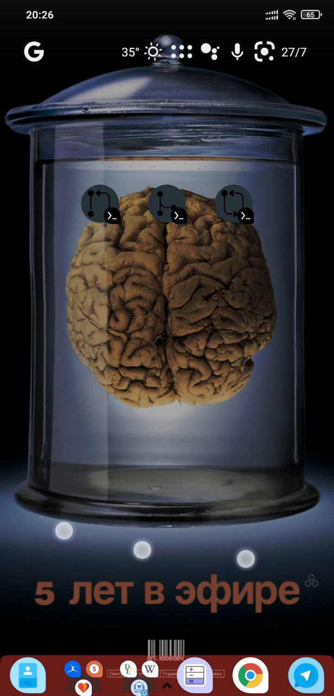

# Termux-Widget-git-obsidian

A [termux-widget](https://github.com/termux/termux-widget) series of bash scripts adapted from [Rene Schallner](https://renerocks.ai/blog/obsidian-encrypted-github-android/) (@renerocksai) for a [Termux](https://github.com/termux/termux-app#github)-git based [Obsidian](http://obsidian.md) vault repositoriing.

This repo include the scripts for _pulling_, _pushing_ and _logging_ the changes on the vault repository with [icons](https://icons8.com) for the android desktop shortcuts.

## Installation
Best way to accomplish repositoriing your Obsidian vault is to follow this [esplendid guide](https://renerocks.ai/blog/obsidian-encrypted-github-android/). Once you reach "[Shortcuts for committing, pushing, and pulling](https://renerocks.ai/blog/obsidian-encrypted-github-android/#shortcuts-for-committing-pushing-and-pulling)" you simply can follow next steps:

### Step by step guide

1. Clone this repository: in your home folder in termux `git clone https://github.com/backmind/termux-widget-git-obsidian`
2. Move all the folder to `/scripts/` your `home`: `mv /scripts/ ~`
3. Set execution privileges for `install.sh`: `chmod +x ~/scripts/install.sh`
4. Execute the installation: `.~/install.sh`
   - Introduce the name of your vault that already has been pulled in termux
5. ...
6. Profit

You can safely remove the `/scripts/` folder

Now you can add the scripts to the desktop of your android device using [Termux-widget].
